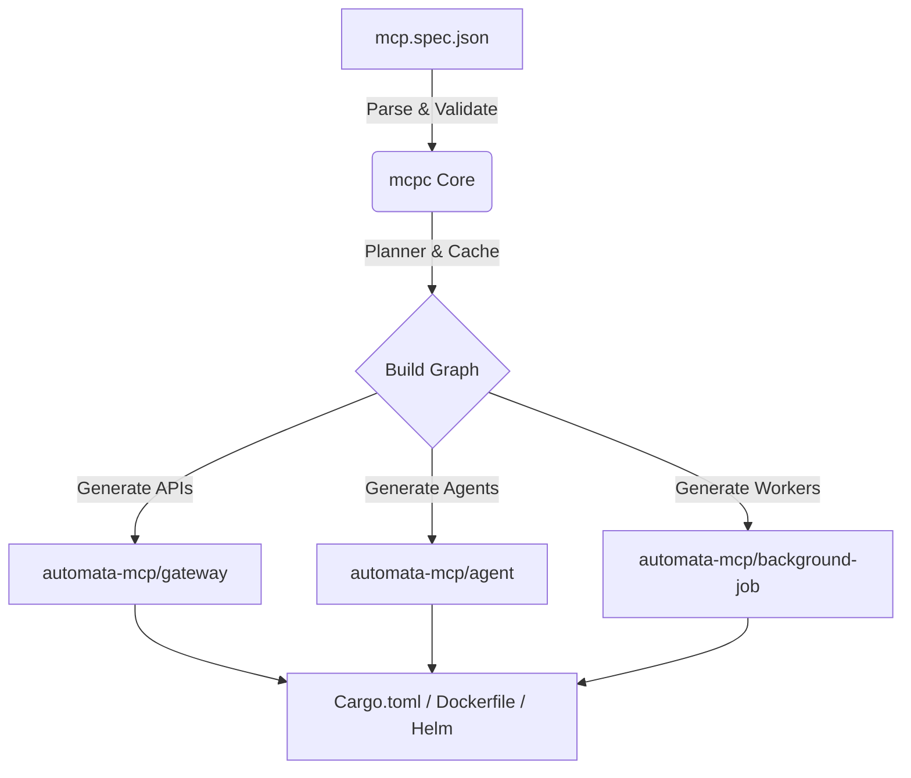

# mcpc - MCP Compiler

`mcpc` is the Model Context Protocol Compiler for generating and orchestrating cloud-native architectures. It takes a declarative specification (`mcp.spec.json`) and generates complete Rust module scaffolding, Dockerfiles, Helm charts, and a robust cargo workspace.

## Motivation
Manually maintaining boilerplate for agents, APIs, and background workers in cloud architectures is tedious and prone to configuration drift. `mcpc` ensures your microservices are structured uniformly, generating best-practice scaffolding so you can focus on building features.

## Capabilities

- **Declarative Infrastructure**: Define your entire service topology in `mcp.spec.json`.
- **Advanced Templating**: Uses Handlebars for flexible templating. Includes production-ready defaults embedded directly in the binary, with support for local project overrides in `.mcpc/templates/`.
- **Incremental Builds**: Fast, content-addressable caching ensures we only rebuild modules when their definition, features, or template source code changes.
- **Plugin Ecosystem**: Extensible pre-validation and post-build hooks (support for Python, JS, or Webhook plugins).
- **Professional Diagnostics**: Beautiful, rich terminal diagnostics via `miette` for configuration and compilation errors.
- **Strict Schema Validation**: Built-in Draft-7 JSON Schema enforcement to catch typos and invalid configurations instantly.
- **Production-Ready Output**: Automatically generates valid Rust Workspaces, Docker-Compose setups, and Helm Charts ready for Kubernetes.

## Quickstart

### macOS / Linux

```bash
# 1. Install mcpc
cargo install mcpc

# 2. Build the workspace
mcpc build

# You can also run a dry-run to see what would be generated:
mcpc build --dry-run

# Run with verbose logging for debugging
mcpc build --verbose
```

### Windows (PowerShell / CMD)

```powershell
# 1. Install mcpc
cargo install mcpc

# 2. Build the workspace using the compiled executable
mcpc.exe build

# You can also run a dry-run to see what would be generated:
mcpc.exe build --dry-run

# Run with verbose logging for debugging
mcpc.exe build --verbose
```

## Architecture



## `mcp.spec.json` Schema

The MCP specification follows a strict JSON schema:

```json
{
  "$schema": "http://json-schema.org/draft-07/schema#",
  "type": "object",
  "required": ["project", "modules"],
  "properties": {
    "project": { "type": "string" },
    "modules": {
      "type": "array",
      "items": {
        "type": "object",
        "required": ["name"],
        "properties": {
          "name": { "type": "string", "pattern": "^[a-zA-Z0-9_-]+$" },
          "type": { "type": "string", "enum": ["api", "worker", "agent", "default"] },
          "entry": { "type": ["string", "null"] },
          "features": { "type": "array", "items": { "type": "string" } },
          "dependencies": { "type": "array", "items": { "type": "string" } }
        }
      }
    }
  }
}
```

## Generated Project Structure

```text
automata-mcp/
├── Cargo.toml               # Workspace manifest
├── docker-compose.yml       # Local orchestration
├── gateway/                 # API module
│   ├── Cargo.toml
│   ├── Dockerfile
│   ├── src/
│   │   ├── main.rs          # Axum boilerplate
│   │   └── lib.rs           # Workspace target
│   └── charts/              # Helm templates
├── agent/                   # Agent module
│   ├── Cargo.toml
│   ├── Dockerfile
│   └── src/
│       ├── main.rs
│       └── lib.rs
└── .mcpc/                   # Build cache
```
